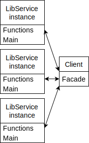
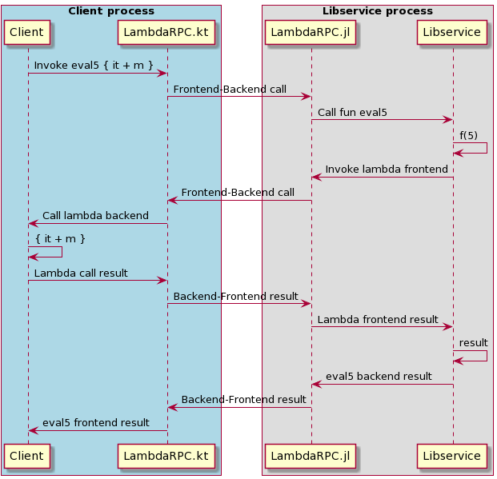
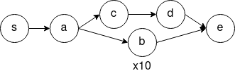
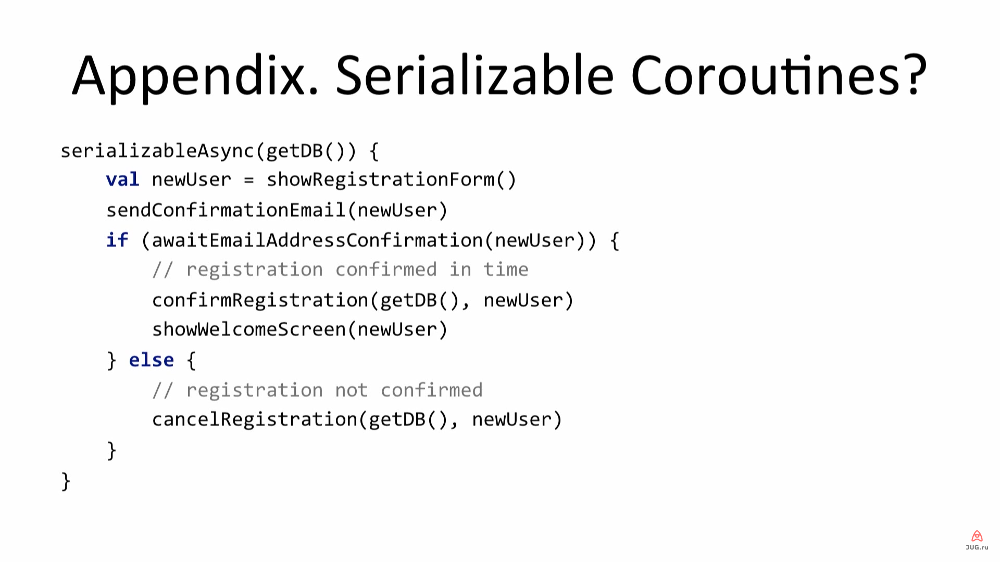

= Разработка библиотеки удаленного вызова процедур с поддержкой функций высших порядков
Андрей Стоян
:icons: font

[.centered]
== Удаленный вызов процедур (RPC)

*Удаленный вызов процедур* (remote procedure call, RPC) -- разновидность межпроцессного взаимодействия, при котором программа, вызывая функцию, запускает её выполнение в другом адресном пространстве (на удалённых узлах, либо в независимой сторонней системе на том же узле).

.Широко используется в связи с
* Относительной простотой использования
* Распространением распределённых архитектур систем
* Гетерогенностью современных компьютерных систем

[.centered]
== Функция высшего порядка (HOF)

*Функция высшего порядка* (high-order function, HOF) -- в функция, принимающая в качестве аргументов другие функции или возвращающая другую функцию в качестве результата.

* HOFs часто используются как в промышленном коде, так и в научных вычислениях

[.centered]
== Мотивация

// В связи с вышесказанным, можно выделить следующие проблемы

// Утилитарная задача, ввиду гетерогенности систем и распространении HOF
* Использование библиотеки с HOF из другого языка программирования (нельзя использовать сериализацию байткода)
// В связи с распространением распределенных архитектур
* Устранение кардинального различия между программными интерфейсами библиотек и сервисов
// https://stackoverflow.com/questions/13660267/erlang-serialization
** Использование HOF, передача замыканий с состоянием
** Сокрытие сериализации от пользователя и использование специфичных для библиотеки-сервиса структур данных
* Исследование применения функциональных подходов к распределённому программированию

[.centered]
== Существующие решения

.gRPC
* Популярный RPC фреймворк от Google
* Использует Protobuf для описания структур данных и интерфейсов сервисов, генерирует код для каждого из поддерживаемых языков

.Communicator
* Прототип RPC с поддержкой функций высших порядков
* Реализован на базе ZMQ (очередь сообщений)
* Реализует идею исполнения переданных функций на клиенте

[.centered]
== Недостатки существующих решений

.gRPC
* Не поддерживает функции высших порядков
* Генерируемый код не всегда удобен для использования
* Сложно преобразовать библиотеку в gRPC сервис

.Communicator
* Сложная реализация из-за использования ZMQ
* Трудно портировать на другие платформы
** Вызывать код на Си
** Реализовывать клиент-сервер ZMQ

[.centered]
== Цель и задачи

*Цель*: разработать RPC библиотеку, позволяющую использовать код с функциями высших порядков как сервис.

.Задачи:
. Разработать способ преобразования библиотеки функций в сервис
. Спроектировать механизм передачи функций
. Реализовать RPC библиотеку для Kotlin и Julia
. Реализовать примеры использования библиотеки

[.two-col]
== Преобразование библиотеки в сервис

.*LibService* -- тройка из
. Кода библиотеки функций
. Фасада -- деклараций экспортируемых из библиотеки функций
. `Main` функции:
** Запускает libservice
** Устанавливает соответствие между декларациями и функциями библиотеки

--

--

[.centered]
== Механизм передачи функций

[source,Kotlin]
----
internal class CodingScope(val context: CodingContext) {
    fun <T> Encoder<T>.encode(value: T): Entity = ...
    fun <T> Decoder<T>.decode(entity: Entity): T = ... }
----

.Кодирование функций для передачи:
* Функция с кодерами сохраняется как *BackendFunction*
* Результат кодирования -- сериализуемый прототип

.Декодирование функций -- получение и использование:
* По полученному прототипу создается *FrontendFunction*
* FrontendFunction -- вызываемый (callable) прокси-объект, который общается с соответствующей BackendFunction

[.two-col]
== Пример: механизм передачи функций

.LibService
--
[source,Kotlin]
----
suspend fun eval5(
    f: suspend (Int) -> Int
): Int = f(5)

val eval5 by serviceId.def(
    f(j<Int>(), j<Int>()),
    j<Int>()
)
----

// Ресурс на клиенте
.Клиент
[source,Kotlin]
----
import service.facade.eval5

val m = 37;
eval5 { it + m }
----
--

[.two-col]
== Библиотека λRPC

--
* Основная реализация на Kotlin, частичная на Julia
* Основана на gRPC
* Компактная реализация (~4kloc)

--

* DSL для сервера и клиента
* λRPC функции из двух частей
** Frontend часть можно пересылать другим сервисам
** λRPC обеспечивает эффективную коммуникацию с backend частью
* Расширяемый механизм кодеров

[.centered]
== Пример: сервис машинного обучения

.Библиотека функций
[source,Kotlin]
----
typealias DataLoader = suspend () -> Data
suspend fun fit(
    model: Model, loader: DataLoader,
    continueLearning: suspend (Epoch, Metric) -> Boolean
): Model { ... }
----

.Фасад
[source,Kotlin]
----
val cl = f(j<Epoch>(), j<Metric>(), j<Boolean>())
val fit by mlServiceId.def(ModelCoder, f(j<Data>()), cl, ModelCoder)
----

.Main
[source,Kotlin]
----
fun main() {
    val service = LibService(mlServiceId, mlEndpoint){fit of ::fit}
    service.start(); service.awaitTermination()
}
----

[.centered]
== Пример: клиент (1)

* Корутины в Kotlin запускаются в `CoroutineScope`
* `CoroutineScope` содержит `CoroutineContext` с диспатчером для корутин (определяет, на каких потоках запускать корутины)
* `ServiceDispatcher` содержит перечень адресов libservice

[source,Kotlin]
----
val serviceDispatcher = ServiceDispatcher(
    mlServiceId to mlEndpoint,
    dataServiceId to dataEndpoint
)

fun main() = runBlocking(serviceDispatcher) {
    ....
}
----

[.centered]
== Пример: клиент (2)

[source,Kotlin]
----
import org.mlservice.facade.fit
import org.dataservice.facade.dataloader

fun main() = runBlocking(serviceDispatcher) {
    val history = mutableListOf<Metric>()
    var lastEpoch = 0; val rawModel = Model(...)
    val boundLoader = bf(dataloader)
    val model = fit(rawModel, boundLoader) { epoch, metric ->
        println("Epoch = $epoch, metric = $metric")
        val continueLearning = if (epoch < 300) true else {
            loss < history.takeLast(50).maxOf { it }
        }
        lastEpoch = epoch; history += metric; continueLearning
    }
    println("Epoch = $lastEpoch, metric = ${history.last()}")
    model.save("my/experiments")
}
----

[.centered]
== Применения и развитие λRPC

* Упрощение клиент-серверной коммуникации за счет HOF
* Безопасность: отправлять замыкание вместо данных
* Предоставлять HOF, а не исполнять пользовательский код

* Serverless libservices, автоматическая генерация фасадов
* (Потоковые) пайплайны обработки данных
* Coder с обеспечением сохранности, воспроизводимости и отслеживанием эволюции данных
* Пайплайны -- альтернатива сериализуемым корутинам?

[.centered]
== Результаты

* Разработан способ преобразований библиотеки функций в сервис
* Спроектирован механизм передачи функций
* Реализована библиотека λRPC для Kotlin и частично для Julia
* Приведены примеры использования λRPC c функциями высших порядков

[.centered]
== Дополнительные слайды

[.centered]
== Ссылки

* https://github.com/mipt-npm/communicator[Communicator]
* https://zeromq.org/[ZMQ]
* https://github.com/winter-yuki/LambdaRPC.kt[LambdaRPC.kt]
* https://github.com/winter-yuki/LambdaRPC.jl[LambdaRPC.jl]

[.centered]
== Дублирование фасадов

Дублирование фасадов для каждого языка позволяет получить нативную (не сгенерированную) реализацию используемых структур данных, то есть пользоваться ими удобнее.

В то же время при изменении придется править множество реализаций.

.Решение -- использовать gRPC Coder и задавать структуры данных в Protobuf, если
* Требуется поддержка большого числа языков (АПИ выставляется наружу)
* Повышенные требования обратной совместимости

[.centered]
== Портирование λRPC

.Реализовать λRPC на Си и писать биндинги для платформ
* `+` Код на платформе просто (?) делегирует всё коду на Си
* `-` Интегрировать модель асинхронности платформы с Си
* `-` Неприятный процесс портирования -- взаимодействие с Си

.Реализовывать λRPC для каждой из платформ поверх gRPC
* `+` Работа с асинхронностью платформы (благодаря gRPC)
* `+` Писать код для платформы приятнее, чем биндинги для Си
* `-` Придется написать спецификацию
* `-` Каждая из реализаций небольшая, но нетривиальная

[.centered]
== LambdaRPC.jl

.Фасад
[source,Julia]
----
@facade serviceId begin
    add5::Int => Int
end
----

.Клиент
[source,Julia]
----
using Lib

function main()
    setendpoint(lib, "localhost", 8088)
    println(add5(37))
end
----

[.centered]
== Пример: пользовательский кодер

.Библиотека
[source,Kotlin]
----
object ModelCoder : DataCoder<Model> {
    override fun encode(value: Model): RawData = ...
    override fun decode(data: RawData): Model = ...
}
----

.Фасад
[source,Kotlin]
----
val loader = f(j<Data>())
val continueLearning = f(j<Epoch>(), j<Metric>(), j<Boolean>())
val fit by mlServiceId.def(
    ModelCoder, loader, continueLearning,
    ModelCoder
)
----

[.centered]
== Пример: ленивый пайплайн (1)

.Вспомогательные определения
[source,Kotlin]
----
typealias Promise<R> = suspend () -> R

fun <A, B, R> lazify(
    f: suspend (A, B) -> R
): suspend (Promise<A>, Promise<B>) -> Promise<R> = { a, b ->
    require(a is ConnectedFunction)
    require(b is ConnectedFunction);
    {
        coroutineScope {
            val aa = async { a() }
            val bb = async { b() }
            f(aa.await(), bb.await())
        }
    }
}
----

[.centered]
== Пример: ленивый пайплайн (2)

.Библиотека & Main
[source,Kotlin]
----
fun s(): Int = 1
fun e(x: Int, y: Int): Int = x + y
...

fun main() {
    val service = LibService(
        serviceId, Endpoint("localhost", port)
    ) {
        s of lazify(::s)
        e of lazify(::e)
        ...
    }
    service.start()
    service.awaitTermination()
}
----

[.centered]
== Пример: ленивый пайплайн (3)

.Клиент
[source,Kotlin]
----
fun main(args: Array<String>) = runBlocking(
    ServiceDispatcher(serviceId to args.map {
        Endpoint("localhost", it.toInt())
    })
) {
    val s = ss(); val a = a(s)
    val b = List(10) { b }.fold(a) { b, f -> f(b) }
    val c = c(s, 2); val d = d(c); val e = e(b, d)
    println("The answer is: ${e()}")
}
----

[.centered]
== https://youtu.be/ffIVVWHpups?t=2972[Serializable coroutines]

